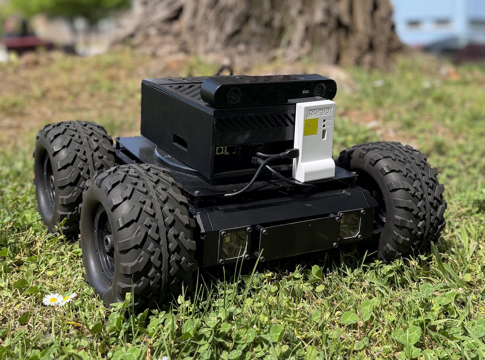

# MiviaRover

MiviaRover is an open, research-oriented UGV platform developed at the
**MIVIA Lab – University of Salerno** for autonomous navigation in off-road
and semi-structured outdoor scenarios. It is built on a Lynxmotion Rugged
Rover chassis and integrates a purpose-built electronics/firmware layer
together with a modular ROS 2 software stack, deliberately avoiding
off-the-shelf embedded control solutions in favor of an architecture
tailored to off-road autonomy.
This repository hosts the **high-level software stack** (ROS 2 Humble) that
runs on the onboard Jetson AGX Orin: perception, localization, planning,
control, and the CAN-based communication with the embedded firmware.


---

## Platform at a Glance

- **Chassis:** Lynxmotion Rugged Rover, tank-like 4-wheel differential drive.
- **Actuation:** four brushed DC motors (up to 160 RPM), 48-CPR quadrature
  encoders on each shaft, driven via PWM from a custom PCB.
- **Onboard computing:**
  - **High level:** NVIDIA Jetson AGX Orin — perception, localization,
    planning, control (soft real-time).
  - **Low level:** STM32F767ZI on a custom PCB — wheel-level PID control,
    encoder acquisition, IMU publication, CAN I/O (hard real-time).
- **Sensing:**
  - Stereolabs **ZED 2i** stereo camera (RGB + depth + point cloud + 9-DoF
    IMU) — primary exteroceptive sensor.
  - **Qorvo MDEK1001 (DWM1001)** UWB kit — absolute positioning over a
    deployable anchor infrastructure.
  - **Quadrature encoders** on each motor shaft — wheel odometry.
- **Communication boundary:** high-level ⇄ low-level traffic is carried over
  standard 11-bit CAN at 1 Mbit/s, formalized by a **DBC file** acting as a
  versionable communication contract.

A detailed description of the hardware architecture, sensor suite, software
stack, and firmware is available in the accompanying paper.

---

## Software Stack Overview

The software ecosystem is organized as a modular, multi-rate ROS 2 Humble
stack, with each subsystem packaged as an independent repository and
orchestrated by a unified bringup. Rates are tuned per-loop: EKF at
~100 Hz, `ros2_control` at 50 Hz, point cloud processing at ~10 Hz, camera
acquisition at 15 Hz, Nav2 controller at 20 Hz, local costmap at 5 Hz.

Logical layers:

| Layer | Purpose | Key packages |
|-------|---------|--------------|
| **Description** | URDF/Xacro model, TF tree, meshes, RViz configs | `mivia_rover_description` |
| **Sensing** | Raw sensor drivers (ZED 2i, DWM1001 UWB) | `mivia_rover_sensing` |
| **Perception** | Ground segmentation (Patchwork++), local geometric representation feeding Nav2 costmaps | `mivia_rover_perception` |
| **Localization** | Planar EKF fusing wheel odometry, ZED IMU, and UWB; quality-aware UWB adapter with heteroscedastic covariance | `mivia_rover_localization` |
| **Navigation** | Domain-adapted Nav2 configuration: global/local planners, behavior tree, velocity smoother | `mivia_rover_nav2_bringup` |
| **Platform / Control** | `ros2_control` `SystemInterface` implementation, `diff_drive_controller`, soft real-time CAN bridge with lock-free double buffering | `mivia_rover_platform` |
| **CAN transport** | `ros2_socketcan` integration, DBC-backed serialization/parsing (`Reference`, `EncoderRpms`, `ImuGyroXy`, `ImuAccelXy`, `ImuZ`) | `mivia_rover_can` |
| **Waypoint follower** | CSV-driven mission execution against Nav2 | `mivia_rover_waypoint_follower` |
| **Visualization** | Preconfigured RViz sessions | `mivia_rover_visualization` |
| **Bringup** | Top-level orchestrator; conditionally includes module launch files | `mivia_rover_bringup` |

A companion repository hosts the embedded firmware (STM32F767ZI,
FreeRTOS, custom PCB), which exposes the same DBC-specified CAN interface
consumed by `mivia_rover_can`.

---

## Repository Layout

```
mivia_rover/
├── mivia_rover.repos         # vcs manifest for all ROS 2 packages
├── source_and_rebuild.bash   # dev helper: rebuild + source + launch
├── clear_ws.sh               # clean build/, install/, log/
├── system_configuration/     # systemd units + scripts for onboard deployment
│   ├── env/                  # runtime env file (ROS distro, WiFi, CAN, …)
│   ├── scripts/              # set_network.sh, start_mivia_rover.sh
│   ├── systemd/              # .service units
│   ├── reload_services.sh    # (re)install and start services
│   └── uninstall_services.sh
└── src/                      # populated by `vcs import` — not tracked
    ├── mivia_rover_bringup/
    ├── mivia_rover_can/
    ├── mivia_rover_description/
    ├── mivia_rover_localization/
    ├── mivia_rover_mapping/
    ├── mivia_rover_nav2_bringup/
    ├── mivia_rover_perception/
    ├── mivia_rover_platform/
    ├── mivia_rover_sensing/
    ├── mivia_rover_visualization/
    └── mivia_rover_waypoint_follower/
```

The `src/` tree is not version-controlled in this repository: it is
populated via `vcs import` from [mivia_rover.repos](mivia_rover.repos),
which references the individual per-package repositories under the
`mivia-rover-nav2` GitHub organization.

---

## Requirements

- **OS:** Ubuntu 22.04 (tested on the Jetson AGX Orin and on x86_64 dev hosts).
- **ROS 2:** Humble Hawksbill.
- **Toolchain:** `colcon`, `vcstool`, `rosdep`, a working C++17 toolchain.
- **Hardware dependencies (onboard only):**
  - SocketCAN-capable CAN interface(s) wired to the custom PCB.
  - Stereolabs ZED SDK installed and matched against the CUDA version
    shipped on the Jetson.
  - DWM1001 UWB tag connected via USB (and a deployed anchor infrastructure).
- **Third-party ROS 2 packages:** `robot_localization`, `nav2_*`,
  `ros2_control`, `ros2_controllers`, `diff_drive_controller`,
  `ros2_socketcan` (pinned to v1.3.0 by the `.repos` manifest).

Resolve the ROS-side dependencies with:

```bash
sudo apt update
sudo apt install python3-vcstool python3-colcon-common-extensions python3-rosdep
```

---

## Getting Started

### 1. Clone and import packages

```bash
mkdir -p ~/Projects
cd ~/Projects
git clone git@github.com:mivia-rover-nav2/mivia_rover.git
cd mivia_rover
mkdir -p src
vcs import src < mivia_rover.repos
```

### 2. Install system dependencies

```bash
source /opt/ros/humble/setup.bash
rosdep update
rosdep install --from-paths src --ignore-src -r -y
```

Additional non-ROS dependencies (ZED SDK, CUDA, UWB udev rules) must be
installed manually per the vendor instructions — see the per-package
READMEs under [src/](src/).

### 3. Build

```bash
colcon build --symlink-install
source install/setup.bash
```

The helper [source_and_rebuild.bash](source_and_rebuild.bash) performs a
clean rebuild and launches the full bringup in one shot; use
[clear_ws.sh](clear_ws.sh) to wipe `build/`, `install/`, and `log/`.

### 4. Launch

Full system bringup (every module enabled):

```bash
ros2 launch mivia_rover_bringup launch.py
```

[mivia_rover_bringup/launch/launch.py](src/mivia_rover_bringup/launch/launch.py)
is a conditional orchestrator: each module can be toggled or
reconfigured from the command line. For example, to start the rover
without RViz visualization:

```bash
ros2 launch mivia_rover_bringup launch.py \
  enable_mivia_rover_visualization:=false
```

Per-module launch arguments follow the pattern
`enable_<pkg>:=`, `<pkg>_launch_file:=`, `<pkg>_launch_source:=` — see
the module list in [launch.py](src/mivia_rover_bringup/launch/launch.py).

---

## Onboard Deployment (systemd)

The [system_configuration/](system_configuration/) directory packages the
rover as two systemd services so that it boots autonomously on the Jetson:

- `set-network.service` (oneshot) — configures `can0`/`can1` at 1 Mbit/s
  via [scripts/set_network.sh](system_configuration/scripts/set_network.sh)
  and, if enabled, connects to the configured WiFi SSID.
- `mivia-rover-platform.service` — runs
  [scripts/start_mivia_rover.sh](system_configuration/scripts/start_mivia_rover.sh),
  which sources the ROS underlay/overlay and executes
  `ros2 launch $MIVIA_BRINGUP_PACKAGE $MIVIA_BRINGUP_LAUNCH`.

Runtime behavior is parameterized through
[env/mivia_rover.env](system_configuration/env/mivia_rover.env):

| Variable | Purpose |
|---|---|
| `ROS_DISTRO` | ROS 2 distribution used to source the underlay |
| `MIVIA_BRINGUP_PACKAGE` / `MIVIA_BRINGUP_LAUNCH` | Package and launch file invoked at boot |
| `MIVIA_ENABLE_VIZ` | Propagated as `enable_mivia_rover_visualization` |
| `ENABLE_CAN_BUS` | Gate for `set_network.sh` CAN bring-up |
| `WIFI_AUTO_CONNECT`, `WIFI_SSID`, `WIFI_PASSWORD`, `WIFI_IFNAME`, `WIFI_TIMEOUT` | Optional WiFi auto-join at boot |
| `RMW_IMPLEMENTATION` | Optional DDS override (e.g. CycloneDDS) |

Install / refresh the services:

```bash
cd system_configuration
./reload_services.sh
```

Uninstall:

```bash
sudo ./system_configuration/uninstall_services.sh
```

The installer also injects `MIVIA_ROVER_WS_PATH`, `MIVIA_ROVER_USER`,
`MIVIA_ROVER_HOME`, and `ROS_DOMAIN_ID` into the deployed env file, so the
services run against the correct workspace and user.

See [system_configuration/README.md](system_configuration/README.md) for
troubleshooting, log inspection, and manual control of the services.

---

## Key Design Notes

- **2D navigation.** Global planning operates on a priori 2D
  occupancy maps (served by `mivia_rover_mapping`), while the local
  costmap is populated from the *nonground* component of the ZED 2i
  point cloud segmented by Patchwork++. Traversability is therefore
  driven by online geometry rather than a planar range assumption.
- **Quality-aware UWB fusion.** Raw UWB positions are not injected into
  the EKF. The `localization_adapter` node consumes the UWB position
  together with its quality indicator and emits a
  `PoseWithCovarianceStamped` whose covariance is modulated online —
  yielding a heteroscedastic measurement model that is robust to
  multipath and NLOS conditions.
- **Soft real-time hardware interface.** The custom
  `ros2_control` `SystemInterface` in `mivia_rover_platform` uses
  lock-free double buffering, dedicated communication threads, and
  staleness timeouts with a conservative stop behavior so that the
  boundary with the STM32 firmware is predictable and fail-safe under
  communication degradation.
- **DBC as contract.** The `Reference`, `EncoderRpms`, `ImuGyroXy`,
  `ImuAccelXy`, and `ImuZ` CAN frames are formalized in a DBC file
  shared with the firmware. `mivia_rover_can` is layered as
  `ros2_socketcan` (transport) → `control_command` (serialization) →
  `report_parser` (decoding), so software and firmware can evolve
  independently as long as the DBC contract holds.

---

## Development Workflow

Common commands during development:

```bash
# Clean rebuild
./clear_ws.sh && colcon build --symlink-install

# Build a single package
colcon build --symlink-install --packages-select mivia_rover_platform

# Run a specific subsystem in isolation
ros2 launch mivia_rover_localization_bringup mivia_rover_localization.launch.py
ros2 launch mivia_rover_nav2_bringup mivia_rover_nav2_bringup.launch.py
```

Selective bringup is also achievable by toggling modules from
`mivia_rover_bringup/launch.py` at the CLI (see §Getting Started).

---

## License

The contents of this repository are released under the
[Apache License 2.0](LICENSE). Individual packages imported via
[mivia_rover.repos](mivia_rover.repos) may carry their own license; refer
to the `LICENSE` files inside each `src/<package>/` directory.

---

## Citation

If you use MiviaRover in academic work, please cite the reference paper
describing the platform. A BibTeX entry will be made available here once
the paper is published.

---

## Maintainers

MiviaRover is developed and maintained by the
**MIVIA Lab, University of Salerno**. Issues and contributions are
welcome through the per-package GitHub repositories under the
[mivia-rover-nav2](https://github.com/mivia-rover-nav2) organization.
